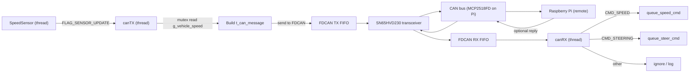

# CAN (Controller Area Network)

## What is CAN
Controller Area Network (CAN) is a multi-master, event-driven, message-oriented serial bus standard widely used in automotive and industrial embedded systems. CAN transmits frames containing an identifier (which encodes message priority) and a payload (classical CAN up to 8 bytes, CAN-FD larger). The protocol provides robust error detection, automatic retransmission, and deterministic arbitration: when multiple nodes transmit simultaneously, the frame with the numerically lower identifier wins arbitration without data corruption.

Key properties:
- Deterministic arbitration for predictable priorities under load.
- Built-in error handling and fault confinement are suitable for noisy vehicle environments.
- Error detection and recovery mechanisms:
  - CRC (Cyclic Redundancy Check): a checksum computed over each CAN frame to detect corrupted bits. Receivers recompute the CRC and reject frames that don't match.
  - ACK (Acknowledge bit): after a frame is received correctly, at least one node on the bus drives the ACK bit to tell the sender the frame was accepted.
  - Bit‑stuffing: to keep clock synchronization, the transmitter inserts the opposite bit after five identical consecutive bits. The receiver removes these stuffed bits and checks stuffing rules to detect framing errors.
  - Automatic retransmission: if a frame is not acknowledged or an error is detected, the controller automatically retries transmission until success or until it moves to an error‑passive or bus‑off state.
- Fault confinement: nodes that repeatedly fail are placed into error-passive or bus-off states to protect the bus.
- Wide ecosystem: mature transceivers, analyzers, software stacks and kernel support (SocketCAN) make integration and diagnostics straightforward.

### Physical layer and transceivers — how it works
- Bus wiring: CAN uses a single twisted‑pair differential wire called CAN_H and CAN_L. All nodes share this pair.
- Differential signaling:
  - Recessive (bus idle / logical 1): both CAN_H and CAN_L sit near the same voltage (approx. mid‑rail). No node is actively driving the bus.
  - Dominant (logical 0 / active): a transceiver actively drives CAN_H higher and CAN_L lower, producing a voltage difference that all receivers detect. Dominant bits override recessive bits on the bus.
- Arbitration: if two nodes start transmitting at the same time, each transmits bits while simultaneously sampling the bus. The node that transmits recessive but senses dominant bit has lost arbitration and stops transmitting — this lets the highest‑priority (lowest ID) message win without collisions.
- Role of the transceiver:
  - MCU side: the FDCAN peripheral exposes single‑ended TXD (transmit) and RXD (receive) signals (3.3 V logic).
  - Transceiver side (SN65HVD230): converts the MCU TXD into differential CAN_H/CAN_L levels for the bus on transmit, and converts the differential bus levels into a single‑ended RXD for the MCU on receive. The transceiver also implements fail‑safe behavior, short‑circuit protection and common‑mode voltage tolerance required on the vehicle bus.
- Termination and grounding: the bus must be terminated with 120 Ω at each physical end and all nodes must share a common ground. Proper termination minimizes reflections and ensures reliable bit timing.
- Why differential: using a differential pair makes the bus robust to common‑mode noise (both wires pick up the same interference, which is rejected by the receiver), important in automotive environments.

Simple signal flow:
- MCU (TXD high/low) → transceiver → drives CAN_H / CAN_L (dominant/recessive) → bus → other transceivers → MCU (their RXD)
- On receive: bus differential → transceiver converts → RXD toggles → FDCAN peripheral samples bits.

## Message formats and ID map
This section defines the canonical CAN IDs, DLCs (Data Length Code) and payload layouts used for remote→car commands and car→remote responses. Use standard 11‑bit IDs unless explicitly noted. Multi‑byte fields use big‑endian (network) byte order.

General rules
- ID priority: numerically lower ID = higher bus arbitration priority.
- Keep messages small and atomic. Prefer fixed DLCs for deterministic parsing.
- Use CAN‑FD when larger payloads are required.
- Reserve an ID range for future expansion and versioning.

## CAN speed and stability
Practical data and recommendations about CAN bitrates, bus length and factors that affect stability.

Speed vs. bus length (rules of thumb)
- Classical CAN (approximate maximum reliable lengths):
  - 1 Mbps → ~40 m
  - 500 kbps → ~100–120 m
  - 250 kbps → ~250 m
  - 125 kbps → ~500 m
- CAN‑FD: arbitration (nominal) phase uses classical timing; data phase runs faster and reduces reliable length drastically:
  - 2–5 Mbps data phase → typical reliable length <50 m
  - 8 Mbps data phase → often <10–20 m (depends on transceivers & cable)

Main stability drivers
- Termination & reflections: incorrect or missing 120 Ω terminations or extra stubs cause reflections and CRC errors.
- Ground/common‑mode: missing common ground or large ground offsets produce unreliable signaling and transceiver stress.
- Cable quality & routing: untwisted pairs, long stubs, noisy proximity and poor connectors increase errors.
- Transceiver and FD support: some transceivers do not support CAN‑FD data rates — verify rise/fall times and max data rate.
- Timing mismatch: clock/timing differences and poorly chosen sample point (TSEG1/TSEG2/SJW) cause bit errors.
- Bus load & congestion: heavy traffic and many nodes increase retransmissions and latency for lower‑priority frames.
- EMI/ESD and noisy power rails: can cause intermittent errors escalating to error‑passive / bus‑off.

Recommended configuration and practices
- Sample point: target ~75–90% (common ~80–88%); tune TSEG1/TSEG2 to match cable topology and node clocks.
- SJW: 1–2 time quanta is typical.
- Filters & offload: use hardware filters + DMA to reduce ISR load and avoid software bottlenecks.
- Minimize stubs, use twisted pair and proper shielding/grounding for vehicle harnesses.
- Use FD‑capable transceivers when using CAN‑FD data phase high bitrates.
- Keep ISR work minimal; parse in a dedicated CAN thread.

Monitoring metrics to track stability
- Error counters (TEC/REC): track rising trends toward error‑passive (≥128) and bus‑off (≥255).
- Error frames / CRC errors: percent of frames with CRC or framing errors (aim ≈ 0).
- Retransmit rate: high retransmit rate indicates timing/noise issues.
- Bus‑off events: any bus‑off requires immediate diagnostics and recovery.
- Message age / latency: monitor end‑to‑end latency for control messages and missed heartbeats.

## Why CAN is used in this vehicle
- Industry relevance: CAN (and CAN-FD) are widely used in automotive systems, using them mirrors real-world architectures.  
- Robustness: built-in error handling and fault confinement are suitable for noisy vehicle environments.  
- Determinism: arbitration by ID gives predictable message delivery ordering under load.  
- Tooling/ecosystem: many transceivers, analyzers and libraries exist, easing integration with diagnostic/debug tools.

We selected a Raspberry Pi 5 as the "remote controller" and the B-U585I-IOT02A (STM32U585) as the vehicle node to match typical industry setups (separate gateway/host and MCU node).

## Selected CAN hardware
- MCU CAN peripheral: STM32U585 internal FDCAN peripheral (supports classical CAN and CAN FD).  
- STM32 transceiver: SN65HVD230 — a low‑power CAN transceiver that interfaces the STM32 FDCAN TX/RX pins to the bus differential lines (CAN_H / CAN_L).  
- Remote host: Raspberry Pi 5 with a 2‑Channel CAN‑BUS(FD) Shield for Raspberry Pi (MCP2518FD). The shield contains the MCP2518FD CAN controller (SPI) and on‑board transceivers, providing two CAN‑FD channels for connection to the same CAN bus.

Notes:
- The MCP2518FD is accessed from the Pi over SPI, we use the appropriate kernel driver / device-tree overlay (mcp2518fd) to expose socketcan interfaces (e.g., can0/can1).  

## Wiring and termination
- We connected the STM32 transceiver (SN65HVD230) and the Raspberry Pi MCP2518FD shield transceiver on a single differential bus: CAN_H ↔ CAN_H, CAN_L ↔ CAN_L. We used a twisted‑pair cable and kept stubs short.
- We placed two 120 Ω termination resistors — one at each physical end of the bus.
- On the STM32 side we connected the FDCAN TX pin to the transceiver TXD and the FDCAN RX pin to the transceiver RXD per the SN65HVD230 datasheet. We powered the transceiver with 3.3 V.
- On the Raspberry Pi side we connected the MCP2518FD shield CAN_H/CAN_L to the same bus and verified the shield's termination jumpers and SPI link.
- We ensured a common ground between the Pi and STM32.
- For EMC (Electromagnetic Compatibility) we routed the CAN differential pair as a twisted pair, avoided running it alongside noisy power traces, and grounded/shielded cable ends as appropriate for the vehicle environment.

## CAN peripheral configuration

The exact register values depend on the clock tree. Below are settings used in this project (FDCAN source clock = 36 MHz) to obtain ~500 kbps for classical CAN.

Timing calculation (36 MHz)
- Bit rate = FDCAN_clock / (Prescaler * (1 + TSEG1 + TSEG2))
- With FDCAN_clock = 36 MHz and the init used in this project:
  - Prescaler = 4
  - TSEG1 = 15
  - TSEG2 = 2
  - Total time quanta = 1 + 15 + 2 = 18
  - Bit rate = 36e6 / (4 * 18) = 36e6 / 72 = 500000 bps
  - Sample point = (1 + TSEG1) / Total ≈ 16 / 18 ≈ 88.9%

Example HAL init excerpt used in this project
```c
hfdcan1.Init.FrameFormat = FDCAN_FRAME_CLASSIC;
hfdcan1.Init.Mode = FDCAN_MODE_NORMAL;
hfdcan1.Init.NominalPrescaler = 4;        /* 36 MHz / (4 * 18 tq) = 500 kbps */
hfdcan1.Init.NominalSyncJumpWidth = 1;
hfdcan1.Init.NominalTimeSeg1 = 15;    
hfdcan1.Init.NominalTimeSeg2 = 2;
```
## CAN Bit Timing (500 kbps, 36 MHz clock, 18 TQ per bit)

Time --->
|--SyncSeg--|--------TSEG1--------|--TSEG2--|
0 TQ       1 TQ                  16 TQ    18 TQ 

Sample Point (SP) --> 1 + TSEG1 = 16 TQ (~88.9% of bit)

### Explanation:
- **SyncSeg:** 1 TQ, used for synchronization
- **TSEG1:** 15 TQ, before sample point, allows signal propagation
- **Sample Point (SP):** Moment controller reads bus value
- **TSEG2:** 2 TQ, after sample point, for edge adjustment before next bit

## ThreadX integration — CAN (implementation & flow diagrams)

Overview
- We implemented CAN as two dedicated ThreadX threads: canTX (transmit) and canRX (receive).
- Data structure: t_can_message { uint32_t id; uint8_t data[8]; uint8_t len; } is used to pass frames between threads and queues.

Concurrency & IPC
- TX queues: tx queues are used to deliver parsed command messages to relevant subsystems (queue_speed_cmd, queue_steer_cmd).
- Event flags: an event_flags group signals sensor updates and message arrivals (e.g., FLAG_SENSOR_UPDATE, FLAG_CAN_SPEED_CMD).
- Mutex: speed_data_mutex protects the shared float g_vehicle_speed when canTX reads it.

canTX thread (transmit)
- Waits on FLAG_SENSOR_UPDATE (tx_event_flags_get).
- Reads g_vehicle_speed under speed_data_mutex.
- Builds a CAN status message via make_speed_status_msg (copies float into payload) and calls can_send().
- can_send() prepares an FDCAN_TxHeaderTypeDef and calls HAL_FDCAN_AddMessageToTxFifoQ(). On failure, it logs over UART.
- Thread sleeps (tx_thread_sleep) between iterations.

canRX thread (receive)
- Polls FDCAN RX FIFO fill level and calls HAL_FDCAN_GetRxMessage() when data is available.
- Converts HAL headers to t_can_message and routes messages by ID:
  - CMD_SPEED → enqueue to queue_speed_cmd + set FLAG_CAN_SPEED_CMD
  - CMD_STEERING → enqueue to queue_steer_cmd + set FLAG_CAN_STEER_CMD
- Thread sleeps briefly (tx_thread_sleep) between polls.

HAL / FDCAN usage
- HAL FDCAN APIs are used for TX FIFO enqueue and RX FIFO read.
- Notifications were enabled (FDCAN_IT_RX_FIFO0_NEW_MESSAGE) in init. Current code uses polling in canRX but can be adapted to use HAL callbacks/ISR signaling.

Error handling
- Transmission failure: can_send() logs "FailTransmitCAN!" via UART and returns (no retransmit logic in software).
- RX path: unknown IDs are ignored.

Summary
- Two dedicated ThreadX threads handle CAN: canTX (transmit) and canRX (receive).
- canTX: waits for the speed sensor to update g_vehicle_speed, builds a speed status message, and enqueues it to the FDCAN TX FIFO (sent to the Raspberry Pi).
- canRX: waits for incoming CAN frames, parses ID, and enqueues messages to either the DC motor queue or servo queue depending on the ID.

