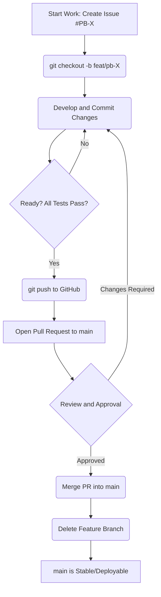

# 🌳 Branching Strategy and Workflow Documentation
This document defines the branching strategy, naming conventions, and workflow rules that the team must follow to ensure smooth code integration, maintain a stable main branch, and comply with version control standards
<br>
## 1- Core Strategy: Feature Branch Workflow
| Branch Name | Purpose | Protection Status | Lifecycle |
|-------------|---------|-------------------|-----------|
| **main** | The stable, production-ready version of the code All merged PRs end here | Protected Direct pushes are forbidden | Permanent |
| **Feature/Topic Branches** | Used for all new work, bug fixes, TSF documentation updates, and experiments | Unprotected | Deleted immediately after a successful PR merge |
## 2- Branch Naming Conventions
All feature/topic branches must follow one of the specific prefixes below, separated by a forward slash (/)
| Prefix | Type of work | Example |
|--------|--------------|---------|
| **feat/** | New features or implementing User Stories | feat/pb-1-hardware-setup |
| **fix/** | Bug fixes | fix/gui-rendering-error |
| **docs/** | Updates to documentation (TSF guides, READMEs, etc.) | docs/update-board-usage |
| **refractor/** | Code structure improvements without changing behavior | refactor/rust-motor-module |
| **spike/** | Proofs of Concept (PoCs) or research tasks | spike/genai-tool-config |

#### Mandatory Rule: Always include the Issue ID (e.g., pb-X) in the branch name for easy tracking.

## 3- Branch Lifecycle and Workflow
The core principle is: **Every code change must go through a Pull Request (PR) into `main`**
<br>
**1 - Start Work:** Before starting any work, ensure the corresponding **Issue** is in the **In Progress** column on the Project Board and create a new branch from the latest `main`.
```bash
git checkout main
git pull origin main
git checkout -b feat/pb-X-my-task-description
```
<br>

**2 - Develop & Commit:** Work and commit changes locally on the feature branch.
<br>

**3 - Ready for Review:** Once the work is complete, local tests pass, and the code is ready for review, **push the feature branch** to GitHub and create a **Pull Request (PR)** targeting the `main` branch.
<br>

**4 - Review and Merge:** The PR must be reviewed and receive the **minimum required approvals** (as defined in PB-6). Once approved, the PR is merged using the **Squash and Merge** or **Rebase and Merge** option (to be decided by the Scrum Master).
<br>

**5 - Clean Up: The feature branch must be deleted immediately after a successful merge** to keep the repository history clean.

## 4- Workflow Diagram
The following diagram illustrates the required process for integrating code:
